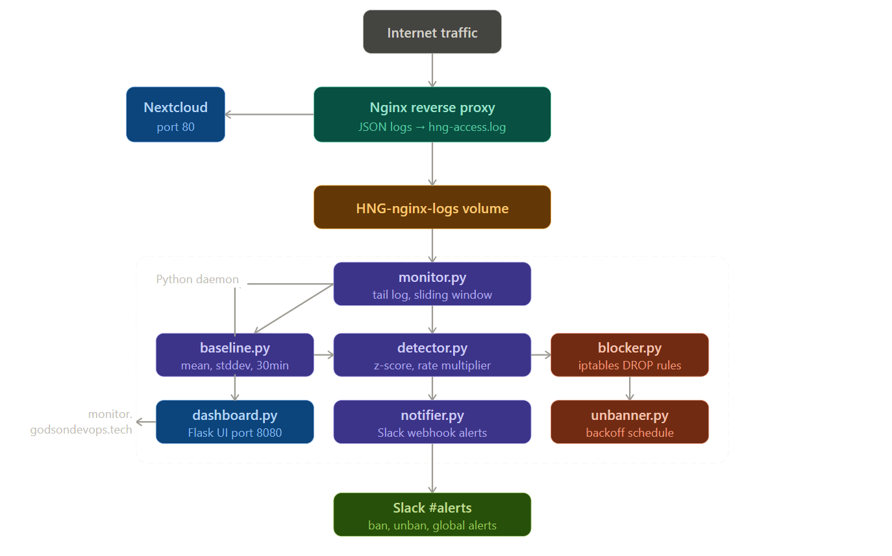

# HNG Anomaly Detection Engine



This is a real-time anomaly detection and DDoS protection daemon built as part of the HNG DevOps internship Stage 3 task. It runs alongside a Nextcloud instance, watches all incoming HTTP traffic through Nginx, learns what normal traffic looks like, and automatically blocks suspicious IPs using iptables when something deviates from the norm.

**Live Dashboard:** https://monitor.godsondevops.tech

**Server IP:** 13.219.92.183

**GitHub:** https://github.com/Godson-7/hng-detector

**Blog Post:** https://medium.com/@godsontutu275/how-i-built-a-real-time-ddos-detection-engine-from-scratch-199c9123f2fb


## Language Choice

I chose Python because it allows fast development, has readable threading support, and the standard library includes everything needed for this project including deque for the sliding window, statistics for baseline math, subprocess for iptables, and Flask for the dashboard. The daemon is not CPU-bound so Python works perfectly here.


## How the Sliding Window Works

Every request that hits Nginx gets parsed and its timestamp is stored in a deque. There is one deque per IP address and one global deque tracking all traffic.

Before counting requests, the code evicts all timestamps older than 60 seconds from the left side of the deque like this:

```python
def _evict_old(self, dq, cutoff):
    while dq and dq[0] < cutoff:
        dq.popleft()
```

The current rate is then calculated as the number of remaining entries divided by 60. This means the window always reflects exactly the last 60 seconds from right now, not from a fixed clock boundary. As time moves forward, old entries fall off the left and new ones are appended to the right.


## How the Baseline Works

Every second, the current global request rate is recorded into a rolling deque that holds a maximum of 1800 entries which equals 30 minutes of data. Every 60 seconds the baseline engine recalculates the mean and standard deviation from this data.

The engine also maintains per-hour slots. If the current hour has collected at least 120 samples, it prefers that data over the full 30-minute window because it better reflects the traffic pattern for that specific time of day.

Floor values are enforced to prevent division by zero. The mean floor is 1.0 and the stddev floor is 0.5. The effective mean is never hardcoded and always reflects real recent traffic.


## How Anomaly Detection Works

Every second, the detector checks each active IP and the global rate against the baseline using two conditions. Whichever fires first triggers the response.

The first condition is a z-score check. If the current rate is more than 3 standard deviations above the mean, it is flagged as anomalous.

The second condition is a multiplier check. If the current rate is more than 5 times the baseline mean, it is flagged regardless of the z-score.

If an IP also has a 4xx or 5xx error rate that is 3 times higher than the baseline error rate, the detection thresholds are automatically tightened by 30 percent to catch it faster.


## How iptables Blocking Works

When an IP is flagged, the blocker adds a DROP rule using iptables like this:

```python
cmd = ['iptables', '-A', 'INPUT', '-s', ip, '-j', 'DROP']
```

This drops all packets from that IP at the kernel level before they ever reach Nginx or Nextcloud. The unbanner thread checks every 10 seconds whether a ban has expired and removes the rule automatically. The ban duration follows a backoff schedule: 10 minutes for the first offense, 30 minutes for the second, 2 hours for the third, and permanent after that. A Slack notification is sent on every ban and unban.


## Setup Instructions

Start with a fresh Ubuntu 22.04 VPS with at least 2 vCPU and 2GB RAM. Open ports 22, 80, 443, and 8080 in your firewall or security group.

Install Docker by running the following commands one at a time:

```bash
sudo apt update && sudo apt upgrade -y
sudo apt install -y ca-certificates curl gnupg
sudo install -m 0755 -d /etc/apt/keyrings
curl -fsSL https://download.docker.com/linux/ubuntu/gpg | sudo gpg --dearmor -o /etc/apt/keyrings/docker.gpg
sudo chmod a+r /etc/apt/keyrings/docker.gpg
echo "deb [arch=$(dpkg --print-architecture) signed-by=/etc/apt/keyrings/docker.gpg] https://download.docker.com/linux/ubuntu $(. /etc/os-release && echo "$VERSION_CODENAME") stable" | sudo tee /etc/apt/sources.list.d/docker.list > /dev/null
sudo apt update
sudo apt install -y docker-ce docker-ce-cli containerd.io docker-buildx-plugin docker-compose-plugin
sudo usermod -aG docker $USER
newgrp docker
```

Clone the repository:

```bash
git clone https://github.com/Godson-7/hng-detector.git
cd hng-detector
```

Open detector/config.yaml and set your Slack webhook URL. All thresholds are configurable from that file including the z-score threshold, rate multiplier, sliding window size, and unban schedule.

Start the full stack:

```bash
docker compose up --build -d
```

Verify everything is running:

```bash
docker compose ps
docker compose logs detector --tail=20
curl http://localhost:8080
```

The dashboard will be available at port 8080 and Nextcloud will be accessible via the server IP on port 80.


## Repository Structure

The detector folder contains all the Python source files. main.py is the entry point that starts all components. monitor.py tails the Nginx log and manages the sliding windows. baseline.py handles the rolling 30-minute baseline calculation. detector.py contains the z-score anomaly detection logic. blocker.py manages iptables rules. unbanner.py runs the backoff unban scheduler. notifier.py sends Slack alerts. dashboard.py serves the Flask web UI on port 8080. config.yaml holds all configuration values. The nginx folder contains the reverse proxy configuration with JSON logging enabled. The screenshots folder contains all required proof screenshots for grading.
